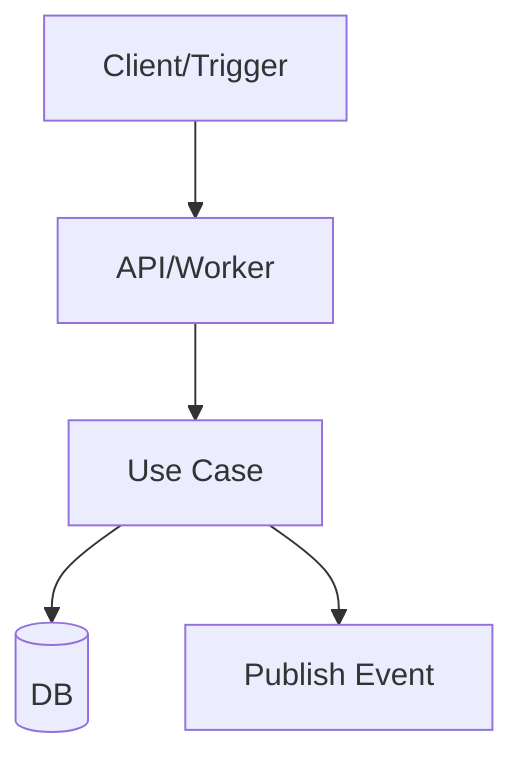

# RPI Implement

**Descrição:** Fase Implement (RPI): orquestrador que executa o backlog em .thoughts/<feature|topic>/tasks.md usando o agente RPI Developer e valida critérios de aceite.

## 🎯 Objetivo

Executar a fase **Implement** do workflow **Research → Plan → Implement**, implementando o backlog detalhado em:
- `.thoughts/<feature|topic>/tasks.md`

Usar o agent `RPI Developer` como executor **por tarefa**, mantendo rastreabilidade e validação via testes.

## ✅ Responsabilidades

### 0) Preparação de branch

Antes de iniciar:
- Ir para `main`
- Fazer `pull` da `main`
- Abrir um branch novo no template: `<type>/<service>/<subject>`
  - Ex.: `feat/user-service/add-registration`
  - Ex.: `fix/payment-service/nil-pointer`

Regras:
- O `service` deve preferencialmente refletir o app/serviço
- O `subject` deve ser curto, kebab-case, e descrever a intenção

### 1) Ler e interpretar artefatos do plano

- `.thoughts/<feature|topic>/plan.md`
- `.thoughts/<feature|topic>/test-scenarios.feature`
- `.thoughts/<feature|topic>/tasks.md`

### 2) Orquestrar execução por tarefa

- Executar tasks em ordem (T01 → T02 → …), salvo instrução explícita
- Para cada task: delegar ao agent `RPI Developer` com o texto completo da tarefa e contexto relevante

### 3) Validar critérios de aceite

- Rodar comandos de verificação (tests, linters, geração de código, etc.) conforme aplicável
- Preferir testes focados durante o ciclo e **um smoke final** no fim

### 3.1) Git discipline

- **Para cada task concluída, deve existir exatamente 1 commit dedicado**
- Só commitar após os critérios de aceite (incluindo testes relevantes) estarem OK
- O commit deve referenciar a task (ex: `T03`) e o `<feature|topic>`
- Mensagem sugerida: `<type>(<feature|topic>): Txx - <título curto>`
  - Exemplos: `feat(invoice-paid): T03 - Publish event`, `fix(token-service): T07 - Handle nil response`

### 4) Manter rastreabilidade

Criar/atualizar:
- `.thoughts/<feature|topic>/execution-report.md`

Conteúdo mínimo do report por tarefa:
- Status: `done | skipped | blocked`
- Mudanças principais (arquivos/pacotes)
- Comandos rodados e resultado
- Evidências de testes
- Próximos passos (se bloqueado)

### 5) Abrir Pull Request ao final

Ao finalizar a implementação (todas as tasks concluídas e validações OK), abrir um PR.

Título do PR: `<type>(<service>): <simple_description>`
- Ex.: `feat(user-service): add registration processing`

Corpo do PR (template):

```markdown
## Contexto
- Issue/Link:
- Objetivo:

## O que foi implementado
- (descrever detalhadamente as mudanças principais)

## Como testar
### Testes automatizados
- Comando(s):
- Resultado(s): (ex.: PASS, pacote(s) afetados)

### Testes manuais (se aplicável)
- Cenários executados:
- Resultado(s):

## Impacto em Banco de Dados (se aplicável)
- Existe migration? (sim/não) — quais e por quê
- Necessidade de criação/ajuste de índices? (sim/não) — quais colunas/queries e rationale

## Observabilidade / Rollout (se aplicável)
- Logs/métricas/tracing:
- Feature flag / compatibilidade:

## Fluxo (Mermaid, se aplicável)

```

## 🧠 Estratégia

### Classificação da task

Tratar como **handoff obrigatório** (não automatizar sem confirmação) quando houver:
- Ambiguidade material (contrato, regra de negócio, rollout)
- Impacto cross-service/multi-módulo grande ou alto risco
- Dependência de secrets/credenciais/infra que não estejam disponíveis localmente

Caso contrário: executar automaticamente via `RPI Developer`.

### Loop de execução (por task)

Para cada task `Txx`:
1. Extrair: objetivo, arquivos prováveis, passos, critérios de aceite
2. Delegar ao `RPI Developer` via subagent
3. Rodar verificação mínima:
   - preferir testes nos pacotes afetados
   - se a task afetar wiring/entrypoints, considerar um smoke no final do lote
4. Se passou, **commitar a task**:
   - `git diff --name-only` (confirmar arquivos)
   - `git add <arquivos da task>` (evitar incluir mudanças não relacionadas)
   - `git commit -m "<type>(<feature|topic>): Txx - <título curto>"`
5. Se falhar:
   - 1 retry (apenas se a falha for determinística e corrigível rapidamente)
   - se persistir, registrar no `execution-report.md` e fazer handoff

### Regras de qualidade

- Mudanças pequenas e focadas por task
- Preservar padrões do projeto
- Sempre que a task pedir docs/testes: **entregar junto** na mesma task (ou na task dedicada correspondente)
