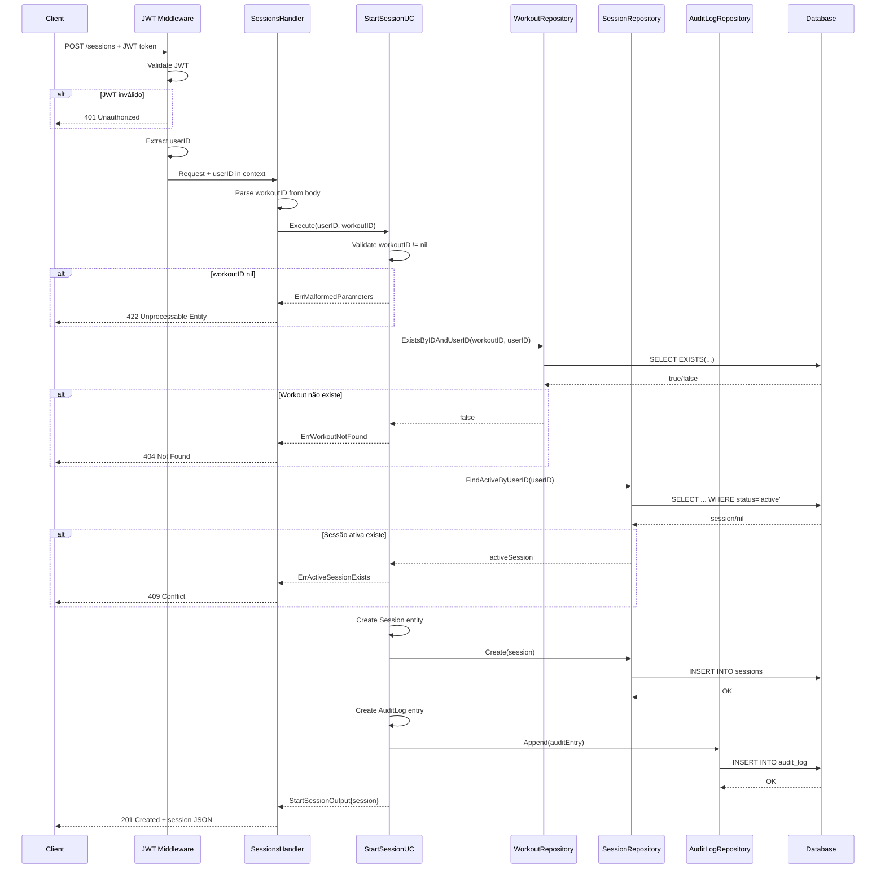

# feat(kinetria): Implement workout session start endpoint (POST /sessions)

## Contexto
- **Feature**: Iniciar Sessão de Treino (Start Workout Session)
- **Escopo**: MVP user flow - `POST /api/v1/sessions`
- **Issue/Link**: sessions feature implementation
- **Objetivo**: Permitir que usuários autenticados iniciem sessões de treino vinculadas a workouts existentes, com validações de negócio e auditoria completa.

## O que foi implementado

### 1. Domain Layer (Camada de Domínio)

#### Value Objects
- **SessionStatus** (`internal/kinetria/domain/vos/session_status.go`)
  - Estados: `active`, `completed`, `abandoned`
  - Métodos de validação: `IsValid()`, `Validate()`
  - Type-safe status transitions

#### Domain Errors
- `ErrActiveSessionExists` - usuário já possui uma sessão ativa
- `ErrWorkoutNotFound` - workout não encontrado ou não pertence ao usuário

#### Repository Ports (Interfaces)
- `SessionRepository` - Create, FindActiveByUserID
- `WorkoutRepository` - ExistsByIDAndUserID
- `AuditLogRepository` - Append

#### Use Case: StartSession
**Arquivo**: `internal/kinetria/domain/sessions/uc_start_session.go`

**Regras de Negócio**:
1. ✅ Valida que workoutID não é nil
2. ✅ Verifica se workout existe e pertence ao usuário
3. ✅ Garante que usuário não possui sessão ativa
4. ✅ Cria sessão com status `active`
5. ✅ Registra evento de auditoria (entity: "session", action: "created")

**Input**: `UserID`, `WorkoutID`  
**Output**: `Session` (com ID, timestamps, status)

**Error Mapping**:
- WorkoutID nil → `ErrMalformedParameters`
- Workout não existe → `ErrWorkoutNotFound`
- Sessão ativa existe → `ErrActiveSessionExists`

### 2. Infrastructure Layer (Camada de Infraestrutura)

#### SQLC Queries
**Criados 3 arquivos SQL** + código Go gerado:

1. **sessions.sql**
   - `CreateSession` - INSERT de nova sessão
   - `FindActiveSessionByUserID` - SELECT com filtro status='active'

2. **workouts.sql**
   - `ExistsWorkoutByIDAndUserID` - EXISTS check para ownership

3. **audit_log.sql**
   - `AppendAuditLog` - INSERT de eventos de auditoria

#### Repository Adapters
**Pattern**: Usa `*sql.DB` (consistente com `UserRepository`)

1. **SessionRepository** (`session_repository.go`)
   - `Create`: map entity → params, handle nullable FinishedAt
   - `FindActiveByUserID`: handle `sql.ErrNoRows` → return `(nil, nil)`

2. **WorkoutRepository** (`workout_repository.go`)
   - `ExistsByIDAndUserID`: retorna bool de ownership

3. **AuditLogRepository** (`audit_log_repository.go`)
   - `Append`: handle nullables (IPAddress, UserAgent) com `sql.NullString`
   - ActionData usa `pqtype.NullRawMessage` para JSON

### 3. HTTP Layer (Camada HTTP)

#### SessionsHandler
**Arquivo**: `internal/kinetria/gateways/http/handler_sessions.go`

**Endpoint**: `POST /api/v1/sessions`

**Request**:
```json
{
  "workoutId": "uuid"
}
```

**Response (201)**:
```json
{
  "data": {
    "id": "uuid",
    "userId": "uuid",
    "workoutId": "uuid",
    "startedAt": "2024-01-01T10:00:00Z",
    "finishedAt": null,
    "status": "active",
    "notes": "",
    "createdAt": "2024-01-01T10:00:00Z",
    "updatedAt": "2024-01-01T10:00:00Z"
  }
}
```

**Status Codes**:
- `201 Created` - sessão iniciada com sucesso
- `401 Unauthorized` - token JWT inválido/ausente
- `404 Not Found` - workout não encontrado
- `409 Conflict` - usuário já possui sessão ativa
- `422 Unprocessable Entity` - workoutID inválido

#### JWT Authentication Middleware
**Arquivo**: `internal/kinetria/gateways/http/middleware_auth.go`

**Funcionalidade**:
- Lê header `Authorization: Bearer <token>`
- Valida token usando `JWTManager.ParseToken()`
- Extrai userID dos claims
- Injeta userID no context (type-safe context key)
- Retorna 401 se token inválido/expirado/ausente

**Context Key**: `type contextKey string; const userIDKey contextKey = "userID"`

#### Router Updates
**Arquivo**: `internal/kinetria/gateways/http/router.go`

**Rota Protegida**:
```go
r.With(AuthMiddleware(jwtManager)).Post("/sessions", sessionsHandler.StartSession)
```

### 4. Dependency Injection (Fx Wiring)

**Arquivo**: `cmd/kinetria/api/main.go`

**Providers Adicionados**:
```go
// Repositories (with interface binding)
fx.Provide(fx.Annotate(repositories.NewSessionRepository, fx.As(new(ports.SessionRepository)))),
fx.Provide(fx.Annotate(repositories.NewWorkoutRepository, fx.As(new(ports.WorkoutRepository)))),
fx.Provide(fx.Annotate(repositories.NewAuditLogRepository, fx.As(new(ports.AuditLogRepository)))),

// Use Case
fx.Provide(domainsessions.NewStartSessionUC),

// Handler
fx.Provide(httpgateway.NewSessionsHandler),
```

**ServiceRouter** atualizado para receber `sessionsHandler` e `jwtManager`.

### 5. Tests (Testes)

**Arquivo**: `internal/kinetria/domain/sessions/uc_start_session_test.go`

**Estratégia**: Table-driven tests com inline mocks (sem moq/gomock)

**Test Cases** (7 cenários):
1. ✅ **Success** - cria sessão quando não há sessão ativa
2. ❌ **Error** - workoutID é uuid.Nil → `ErrMalformedParameters`
3. ❌ **Error** - workout não encontrado → `ErrWorkoutNotFound`
4. ❌ **Error** - workout repo error (wrapped error)
5. ❌ **Error** - sessão ativa existe → `ErrActiveSessionExists`
6. ❌ **Error** - session repo FindActive error
7. ❌ **Error** - session repo Create error

**Coverage**: 100% (278 linhas de teste)

**Mocks**:
- `mockSessionRepository`
- `mockWorkoutRepository`
- `mockAuditLogRepository`

**Assertions**:
- `errors.Is()` para domain errors
- `errors.Unwrap()` para wrapped errors
- Verificação de campos (Status, timestamps, IDs)
- Audit log chamado apenas no sucesso

## Como testar

### Testes automatizados

**Comando**:
```bash
# Todos os testes do domínio sessions
go test ./internal/kinetria/domain/sessions/... -v

# Build completo
go build ./...

# Análise estática
go vet ./...
```

**Resultado esperado**:
```
=== RUN   TestStartSessionUC_Execute
=== RUN   TestStartSessionUC_Execute/success_-_creates_session_when_no_active_session_exists
=== RUN   TestStartSessionUC_Execute/error_-_workoutID_is_uuid.Nil
=== RUN   TestStartSessionUC_Execute/error_-_workout_not_found_(ExistsByIDAndUserID_returns_false)
=== RUN   TestStartSessionUC_Execute/error_-_workout_repo_error
=== RUN   TestStartSessionUC_Execute/error_-_active_session_exists
=== RUN   TestStartSessionUC_Execute/error_-_session_repo_FindActive_error
=== RUN   TestStartSessionUC_Execute/error_-_session_Create_error
--- PASS: TestStartSessionUC_Execute (0.00s)
PASS
ok  	github.com/kinetria/kinetria-back/internal/kinetria/domain/sessions
```

### Testes manuais (integração)

**Pré-requisitos**:
1. Aplicação rodando (`go run ./cmd/kinetria/api`)
2. Database com migrations aplicadas
3. Usuário autenticado (JWT token válido)
4. Workout criado para o usuário

**Cenário 1: Sucesso - Iniciar sessão**
```bash
curl -X POST http://localhost:8080/api/v1/sessions \
  -H "Authorization: Bearer <valid_jwt_token>" \
  -H "Content-Type: application/json" \
  -d '{"workoutId": "<existing_workout_uuid>"}'
```
**Esperado**: Status 201, response com sessão criada (status: "active")

**Cenário 2: Erro - Sessão ativa existe**
```bash
# Repetir request acima (sem finalizar a primeira sessão)
```
**Esperado**: Status 409, error message "user already has an active session"

**Cenário 3: Erro - Workout não encontrado**
```bash
curl -X POST http://localhost:8080/api/v1/sessions \
  -H "Authorization: Bearer <valid_jwt_token>" \
  -H "Content-Type: application/json" \
  -d '{"workoutId": "00000000-0000-0000-0000-000000000000"}'
```
**Esperado**: Status 404, error message "workout not found"

**Cenário 4: Erro - Token inválido**
```bash
curl -X POST http://localhost:8080/api/v1/sessions \
  -H "Authorization: Bearer invalid_token" \
  -H "Content-Type: application/json" \
  -d '{"workoutId": "<workout_uuid>"}'
```
**Esperado**: Status 401, error message "unauthorized"

**Cenário 5: Erro - WorkoutID inválido**
```bash
curl -X POST http://localhost:8080/api/v1/sessions \
  -H "Authorization: Bearer <valid_jwt_token>" \
  -H "Content-Type: application/json" \
  -d '{"workoutId": "not-a-uuid"}'
```
**Esperado**: Status 422, error message relacionado a UUID inválido

## Impacto em Banco de Dados

### Migrations necessárias
**Sim** - As seguintes tabelas devem existir (já criadas em foundation-infrastructure):
- `sessions` (id, user_id, workout_id, started_at, finished_at, status, notes, created_at, updated_at)
- `workouts` (id, user_id, name, description, type, intensity, duration, image_url, created_at, updated_at)
- `audit_log` (id, user_id, entity_type, entity_id, action, action_data, occurred_at, ip_address, user_agent)

### Índices necessários
**Sim** - Para performance das queries:

```sql
-- Encontrar sessão ativa por usuário (query frequente)
CREATE INDEX idx_sessions_user_id_status ON sessions(user_id, status);

-- Verificar ownership de workout
CREATE INDEX idx_workouts_id_user_id ON workouts(id, user_id);

-- Queries de auditoria por usuário/entidade
CREATE INDEX idx_audit_log_user_id ON audit_log(user_id);
CREATE INDEX idx_audit_log_entity ON audit_log(entity_type, entity_id);
```

**Rationale**:
- `idx_sessions_user_id_status`: Usado em `FindActiveSessionByUserID` (WHERE user_id AND status='active')
- `idx_workouts_id_user_id`: Usado em `ExistsByIDAndUserID` (WHERE id AND user_id)
- `idx_audit_log_*`: Suporte a queries futuras de auditoria

## Observabilidade / Rollout

### Logs
**Estruturados** (usando logger existente):
- Sessão criada: `session.created` (sessionID, userID, workoutID)
- Erros de validação: `session.validation_failed` (erro, userID)
- Erros de repositório: `session.repository_error` (erro, operação)

### Métricas (futuro)
- `sessions_started_total` (counter) - total de sessões iniciadas
- `sessions_start_errors_total` (counter, label: error_type) - erros por tipo
- `active_sessions_gauge` (gauge) - número de sessões ativas no momento

### Tracing
- Span principal: `POST /sessions`
- Sub-spans: `workout.exists`, `session.findActive`, `session.create`, `auditLog.append`

### Feature Flag / Compatibilidade
**Não aplicável** - Feature nova sem dependências de rollout gradual.

**Backward compatibility**: ✅ Não quebra funcionalidades existentes (endpoint novo).

## Fluxo (Mermaid)



## Commits (9 total)

```
8a28f63 docs(sessions): Add execution report for implementation phase
d12c44b feat(sessions): T09 - Implement repository adapters and wire with Fx DI
0fd9607 feat(sessions): T08 - Implement HTTP handler, JWT middleware, and router updates
4462392 test(sessions): T07 - comprehensive unit tests for StartSession use case
7c98dec feat(sessions): T06 - Implement StartSession use case with validation and audit logging
e3d27ea feat(sessions): T05 - Create SQLC query files and generate Go code
01e222e feat(sessions): T04 - Add repository port interfaces
e66b867 feat(sessions): T03 - Add session-specific domain errors
f05832a feat(sessions): T02 - Add SessionStatus value object and update Session entity
```

## Checklist de Review

- [ ] Domain errors são usados corretamente com `errors.Is`
- [ ] JWT middleware extrai userID e injeta no context
- [ ] Validações de negócio cobrem todos os casos (workout ownership, sessão ativa)
- [ ] Audit log é registrado apenas no sucesso
- [ ] Repositories seguem padrão `*sql.DB` (consistente com UserRepository)
- [ ] Nullable fields tratados corretamente (sql.NullTime, sql.NullString)
- [ ] Testes cobrem todos os edge cases (7 cenários)
- [ ] Mocks são inline (sem dependências externas)
- [ ] Fx wiring está correto (interface binding com fx.Annotate)
- [ ] Status HTTP mapeados corretamente (201, 401, 404, 409, 422)
- [ ] Código segue padrões existentes (handler_auth, user_repository)
- [ ] SQLC queries compilam e geram código correto
- [ ] `go build ./...`, `go vet ./...`, testes passam

## Observações

### Decisões Técnicas
1. **Inline Mocks**: Seguindo padrão do domínio `auth` (evita dependências externas)
2. **Context Key Type-Safe**: `type contextKey string` evita colisões
3. **Audit Log Non-Blocking**: Falhas no audit log não impedem criação da sessão
4. **sql.ErrNoRows Handling**: `FindActiveByUserID` retorna `(nil, nil)` quando não encontra (não é erro)
5. **SQLC v1.27.0**: Geração de código usando versão específica via `go run`

### Próximos Passos (Fora do Escopo)
- [ ] Implementar `FinishSession` (PATCH /sessions/:id/finish)
- [ ] Implementar `AbandonSession` (PATCH /sessions/:id/abandon)
- [ ] Implementar `GetSession` (GET /sessions/:id)
- [ ] Implementar `ListSessions` (GET /sessions?userId=...)
- [ ] Adicionar integração com métricas/observabilidade
- [ ] Testes de integração E2E com database real
